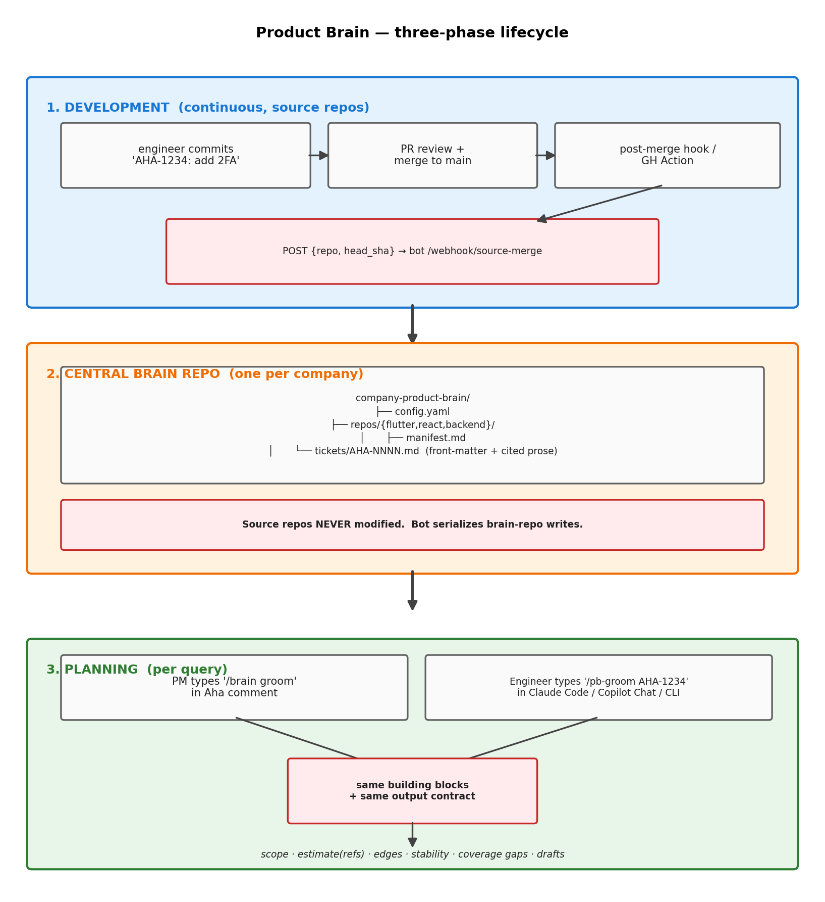
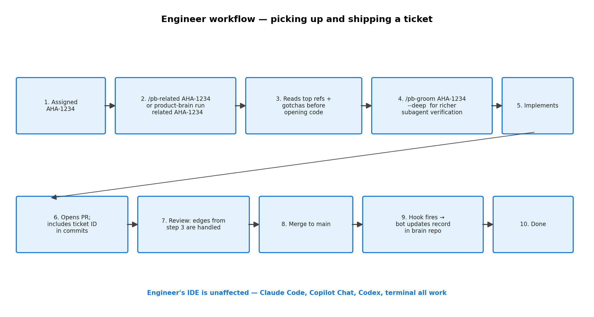

# Product Brain

> A central memory + planning layer that ties project-management tickets to real shipped code across all your product repos, so feature planning, grooming, and estimation are grounded in what was actually built — not just what the spec said.

Product Brain lives in **one central repo** that binds one or more source repos. It reads each source repo's `git log` (where every commit references a ticket ID), enriches with PR review threads, and emits one markdown record per ticket per repo — all stored in the central brain. **Source repos are never modified.** A skill, a CLI, and a headless bot consume that index to answer questions like:

- "Groom AHA-1234 — what's the scope across our 3 sub-products, what edges did we hit on similar work, and how long should it take?"
- "Plan 'password reset' — predict touched areas, find related shipped tickets, draft sub-tickets."
- "Show me everything we've shipped that touched the auth flow."

The PM tool is pluggable. Aha is the reference adapter; the abstract `PMAdapter` interface lets you swap Linear, Jira, or anything with tickets and comments.

---

## Why this exists

Product managers plan against docs. Engineers build against code. The two drift apart: the spec says "we have 2FA," the code says "we have 2FA, but only TOTP, with these three known edge cases that bit us last quarter." When a PM grooms a related feature, they need the second view, not the first.

Product Brain produces that second view automatically by mining `git log + PR history`, with **citation discipline** — every edge case in a record cites a real PR comment, test name, or commit SHA, validated at write time. Hallucinated bullets get dropped, not shipped.

---

## What you get

| Component | What it does |
|---|---|
| **Central brain repo** | One repo (e.g. `company-product-brain/`) holds `repos/<name>/{manifest.md, tickets/AHA-XXXX.md}` for every bound source repo. Source repos stay untouched. |
| **Backfill CLI** | One-shot rebuild from each source repo's `git log --all`. Idempotent. |
| **Incremental hook** | Post-merge hook (or GitHub Action) in each source repo notifies the bot, which updates one record per merge. ~1 small LLM call. |
| **Repair job** | Nightly: validates citations, flags stale gaps, reconciles renames. |
| **Slash commands** | `/pb-groom`, `/pb-plan`, `/pb-edges`, `/pb-related`, `/pb-draft-tickets`, `/pb-sync` — used inside Claude Code by engineers. |
| **Headless bot** | Webhook + worker. PM types `/brain groom` in an Aha comment; bot replies with scoped plan, estimate (with references), edge cases, and draft sub-tickets. Edits in place, never spams. |
| **Admin web UI** | Read-only dashboard + filterable audit log + per-repo health + queue view + restricted-write settings editor. See `screenshots/`. |
| **PM adapter interface** | Abstract base class. Aha implementation included. Swap for Linear/Jira/etc. |
| **Test-management adapter (optional)** | TestRail integration adds `qa_edges`, `stability_signals`, and `coverage_gaps` to records. Pluggable for Zephyr/Xray/qTest. |
| **Pluggable LLM backend** | Anthropic, OpenAI, Azure OpenAI, or any OpenAI-compatible endpoint (Ollama, LM Studio, vLLM, OpenRouter, Groq, ...). Config-only switch. |

---

## How it works

Three phases. Data flows in continuously as engineers merge code; the index sits in the brain repo; data flows out on demand when a PM (or engineer) asks for a plan.



Engineers also reach the planning phase via slash commands inside Claude Code (`/pb-groom AHA-1500`), which run the same building blocks and skip the bot. Same logic, two front doors.

---

## Architecture at a glance


See [docs/architecture.md](docs/architecture.md) for detail.

---

## Stack

| Concern | Library | Pinned version |
|---|---|---|
| Runtime | Node | ≥20.18 (LTS); CI on 22 |
| Compiler | TypeScript | 6.0.3 |
| Tests | Vitest | 2.1.9 |
| Bot HTTP | Fastify | 5.8.5 |
| Queue / audit | better-sqlite3 | 12.9.0 |
| Anthropic SDK | @anthropic-ai/sdk | 0.91.1 |
| OpenAI SDK | openai | 6.34.0 |
| YAML | js-yaml | 4.1.1 |
| CLI | commander | 14.0.3 |
| Validation | zod | 4.3.6 |
| Logging | pino | 10.3.1 |
| Bundler | esbuild | 0.28.0 |
| Dev runner | tsx | 4.21.0 |

---

## Quick start

For the full click-by-click (Aha API key, TestRail token, GitHub token, bot host setup, smoke test, troubleshooting), see **[docs/setup.md](docs/setup.md)**.

What follows is the condensed overview.

### 1. Install

```bash
git clone <this-repo>
cd product-brain-ts
./install.sh
```

The installer:
- copies the skill to `~/.claude/skills/product-brain/`
- copies slash command stubs to `~/.claude/commands/`
- runs `npm install` and `npm run build:bundle` (single-file artifact in `dist/`)

### 2. Create the central brain repo

In a sibling directory to your source repos:

```bash
mkdir company-product-brain && cd company-product-brain
npx tsx /path/to/product-brain-ts/src/cli.ts init
```

(Or `node /path/to/product-brain-ts/dist/product-brain.cjs init` after the bundle build.)

This creates `config.yaml`, `repos/`, `.gitignore`, `README.md`, and `git init`s the directory. Edit `config.yaml` to fill in your Aha (or other PM tool) credentials.

### 3. Bind source repos

For each source repo you want indexed:

```bash
product-brain bind ../flutter-app --name flutter
product-brain bind ../react-app   --name react
product-brain bind ../backend     --name backend
```

Each `bind` call:
- detects languages, entry points, workflow from the source repo
- writes `repos/<name>/manifest.md` into the brain
- appends `{name, path}` to `config.yaml`
- (with `ANTHROPIC_API_KEY`) generates manifest prose from the source repo's README + package files

Source repos are not modified. Use `--no-llm` to skip prose; `--force` to overwrite.

See [docs/manifest-schema.md](docs/manifest-schema.md) for the full schema and [docs/binding.md](docs/binding.md) for the bind workflow.

### 4. Backfill

From the brain repo directory:

```bash
product-brain backfill --repo backend
product-brain backfill                    # all bound repos
```

Walks each source repo's `git log --all`, extracts ticket IDs, enriches with PR data, writes records into `repos/backend/tickets/` inside the brain. Commit the brain repo when done.

Cost: with Haiku, ~$0.005/ticket × N tickets. 5-year repo with 500 tickets ≈ $2.50 and ~10 minutes.

### 5. Wire incremental updates

Two ways to keep the brain current after merges:

**Bot webhook (recommended)** — install a post-merge hook in each source repo that POSTs the bot. Bot pulls source, runs incremental, commits and pushes the brain repo:

```bash
cd ../backend
/path/to/product-brain-ts/scripts/install-post-merge-hook.sh \
  backend https://brain-bot.example.com/webhook/source-merge
```

**GitHub Actions** — drop `scripts/github-action.yml` into each source repo's `.github/workflows/`. Same flow, runs in CI on every push to main.

Either way, source repos never get a `.product-brain/` directory — only a small hook or workflow file that fires a webhook.

### 6. Use it

**As an engineer in Claude Code:**

```
/pb-groom AHA-1234
/pb-plan password reset for the auth area
/pb-related AHA-1234
```

**As a PM in Aha** (after enabling the bot — see [docs/bot.md](docs/bot.md)):

Comment on any ticket with the opt-in label `brain:on`:

```
/brain groom
/brain estimate
/brain draft-tickets
```

The bot replies with a structured comment, edits in place on re-runs, and creates draft sub-tickets when asked.

**As an admin** — read-only dashboard + restricted settings:

```bash
export ADMIN_PASSWORD='choose-something-strong'
product-brain bot admin                                 # localhost:8089/admin/
product-brain bot admin --host 0.0.0.0 --port 9000      # bind elsewhere
```

See `screenshots/` for what each page looks like.

### Workflow at a glance

**Engineer side** — picking up and shipping a ticket:



**PM side** — grooming a feature in Aha:


**Bot internals** — what happens when `/brain groom` is typed:


For a complete walkthrough with sample data, slide deck, and one-pager, see the [demo folder](demo/).

---

## Documentation map

| File | Topic |
|---|---|
| [docs/setup.md](docs/setup.md) | Click-by-click setup (Aha, TestRail, GitHub, brain repo, bot, hooks, smoke test, troubleshooting) |
| [docs/integrations.md](docs/integrations.md) | LLM providers (Anthropic / OpenAI / Azure / local) + engineer-side AI tools (Claude Code / Copilot Chat / Codex / Cursor) |
| [docs/architecture.md](docs/architecture.md) | System architecture, building blocks, data flow |
| [docs/manifest-schema.md](docs/manifest-schema.md) | Manifest and ticket-record schemas |
| [docs/binding.md](docs/binding.md) | Brain repo layout, binding source repos, hook setup |
| [docs/backfill.md](docs/backfill.md) | Backfill algorithm, phases, failure modes |
| [docs/edge-case-mining.md](docs/edge-case-mining.md) | Where edge cases come from, citation discipline |
| [docs/pm-adapter.md](docs/pm-adapter.md) | Abstract PM adapter interface; writing a new adapter |
| [docs/test-adapter.md](docs/test-adapter.md) | Optional TestRail integration; QA-verified edges, stability signals, coverage gaps |
| [docs/bot.md](docs/bot.md) | Headless Aha bot setup, triggers, spam prevention |
| [docs/howto-engineer.md](docs/howto-engineer.md) | Engineer workflow: picking up a ticket, using slash commands |
| [docs/howto-pm.md](docs/howto-pm.md) | PM workflow: grooming, drafting, estimating |
| [docs/build-order.md](docs/build-order.md) | Suggested rollout order if adopting incrementally |
| [docs/distribution.md](docs/distribution.md) | Build pipeline, customer install, update flow |

---

## Project layout

```
product-brain-ts/
├── README.md                       (this file)
├── install.sh                      installs skill + builds CLI bundle
├── config.example.yaml             orchestrator config template
├── .env.example                    secrets template
├── package.json                    Node package
├── tsconfig.json
│
├── commands/                       slash-command stubs → ~/.claude/commands/
│   └── pb-{groom,plan,edges,related,draft-tickets,sync}.md
│
├── skills/product-brain/           the skill → ~/.claude/skills/product-brain/
│   ├── SKILL.md                    auto-trigger description
│   ├── commands/                   command bodies (one per slash command)
│   ├── templates/                  output templates
│   └── schemas/                    JSON schemas for records and config
│
├── docs/                           full documentation
│
├── demo/                           presentation + walkthrough + sample records
│
├── assets/                         workflow diagrams
│
├── screenshots/                    admin UI screenshots
│
├── src/                            TypeScript source
│   ├── cli.ts                      entry: `product-brain <subcommand>`
│   ├── config.ts                   zod-validated config loader
│   ├── models.ts                   types
│   ├── version.ts                  build-time identity
│   ├── adapters/                   PM (Aha) + test (TestRail) adapters
│   ├── llm/                        provider abstraction (Anthropic, OpenAI, Azure, local)
│   ├── records/                    read/write/rename-track ticket records
│   ├── blocks/                     hotspot, estimate, edge_mine, coverage_gap, render
│   ├── backfill/                   git log → records pipeline
│   ├── incremental.ts              post-merge target
│   ├── repair.ts                   nightly validator
│   ├── planner.ts                  composes blocks per command
│   ├── admin/                      web UI: server, auth, db, settings, templates
│   └── bot/                        webhook, worker, queue, comment, audit
│
├── tests/                          vitest test suite (176 tests, 22 files)
│
└── scripts/                        utilities
    ├── build-bundle.ts             esbuild → dist/product-brain.cjs
    ├── release.ts                  pack dist/ into product-brain-X.Y.Z.tgz
    ├── screenshots.ts              re-render admin UI screenshots
    ├── install-post-merge-hook.sh  source-repo hook installer
    ├── github-action.yml           GitHub Actions variant
    └── render-diagrams.py          re-render workflow PNGs (matplotlib)
```

---

## Costs and operational notes

| Action | Cost (Haiku) | Cost (Sonnet) |
|---|---|---|
| Backfill, per ticket | ~$0.005 | ~$0.05 |
| Incremental, per merge | ~$0.005 | ~$0.05 |
| `/pb-groom` (interactive) | ~$0.02–0.05 | ~$0.20–0.50 |
| Bot `/brain groom` (headless) | same as `/pb-groom` | same |

Use Haiku for backfill and incremental (mechanical summarization). Sonnet for interactive grooming if quality matters more than cost.

---

## Development

```bash
cd product-brain-ts
npm install
npm run typecheck       # tsc --noEmit
npm run lint            # eslint
npm run test            # vitest (176 tests)
npm run test:coverage   # v8 coverage
npm run dev -- --help   # tsx src/cli.ts --help
npm run build:bundle    # esbuild → dist/product-brain.cjs (single-file)
npm run release         # build:bundle + tar → product-brain-X.Y.Z.tgz
npm run screenshots     # re-render admin UI screenshots
npm run audit           # npm audit --omit=dev
```

### Status

```
npm audit --omit=dev:  0 vulnerabilities  (runtime deps clean)
tsc --noEmit:          0 errors  (strict mode + verbatimModuleSyntax + isolatedModules)
vitest:                176/176 passing across 22 test files
```

---

## Distribution

`npm run release` produces a single `.tgz` (~340 KB) containing one bundled `.cjs` file plus a minimal `package.json`. Customers extract, run `./install.sh`, and execute `node product-brain.cjs`. Source (`src/**/*.ts`), tests, dev configs, and dev deps are NOT in the bundle.

See [docs/distribution.md](docs/distribution.md) for the full delivery + update flow.

---

## Status and roadmap

- v1: Aha adapter, backfill, slash commands, basic bot (manual triggers), admin UI, TestRail integration, distribution pipeline.
- v1.1: Status-change auto-triggers behind opt-in label.
- v1.2: Linear adapter (drop-in via `PMAdapter`).
- v2: Cross-repo aggregated records, semantic search index (only if MD-grep stops scaling).

---

## License

**Proprietary — All Rights Reserved.** See [LICENSE](LICENSE). No use, copying, or distribution is permitted without prior written permission. Commercial licensing inquiries: contact the owner directly.
