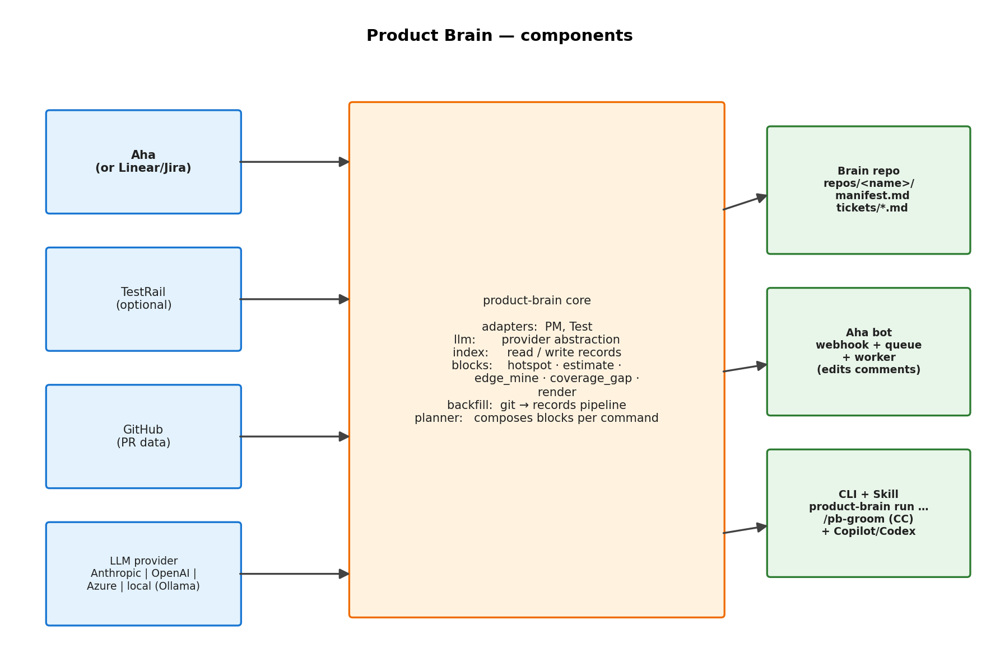
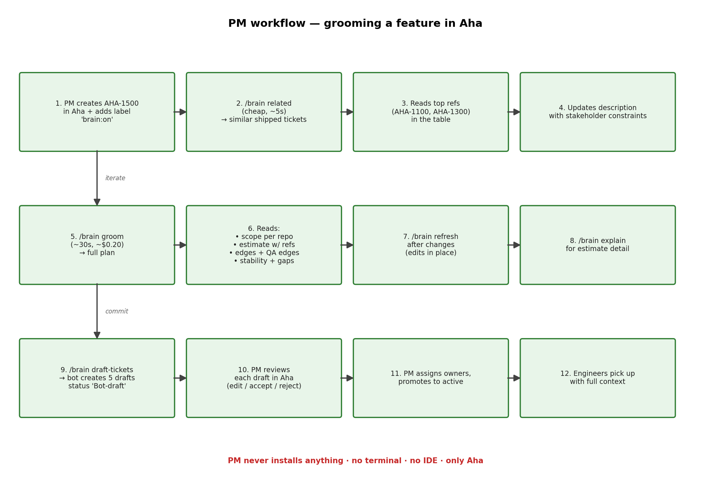
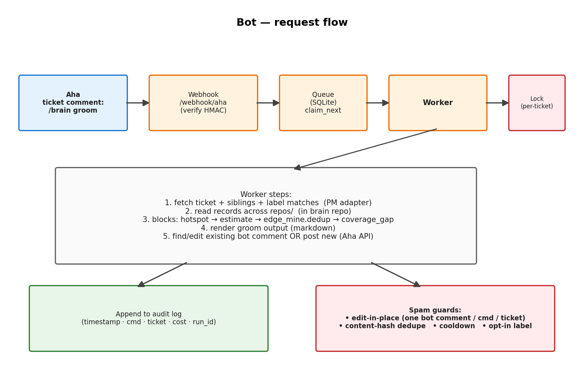

# Product Brain
### Cross-repo memory + planning, grounded in real shipped code

A central index that ties Aha tickets to the actual diff in each sub-product. Asks like "groom this ticket" or "estimate this feature" answer themselves with citations.

---

## The problem

PMs plan against docs.
Engineers build against code.
**They drift.**

The spec says "we have 2FA."
The code says "we have 2FA, but only TOTP, with three known edge cases that bit us last quarter."

When a PM grooms a related feature, they need view #2.
Today they don't have it.

---

## What we do today

| Person | Today |
|---|---|
| PM grooming a new feature | Reads Aha tickets. Hopes to remember edges from past work. |
| Engineer picking up a ticket | Reads ticket. Searches code for vaguely-related areas. |
| Estimate gets challenged | Hand-waves. No data anchor. |
| QA writes test plan | Re-derives edge cases. Often misses ones eng already handled. |

Result: **slow grooming, soft estimates, repeated edge-case work, eng/PM drift.**

---

## What we want

The PM types `/brain groom AHA-1500` in an Aha comment.
30 seconds later the bot replies with:

- **Scope per repo** — flutter / react / backend
- **Estimate** — range with reference tickets and confidence label
- **Edge cases** — mined from related shipped tickets, every bullet citing PR comments / tests / commits / TestRail cases
- **Stability signals** — which scenarios have actually been flaky historically
- **Coverage gaps** — code edges with no QA test
- **Risks** — files with recent hotfix activity
- **Suggested reviewers** — who knows this code
- **Draft sub-tickets** — bot creates them in Aha, status "Bot-draft"

PM reviews, accepts, assigns. Engineering picks up with full context.

---

## How it works — three phases


---

## What's in the brain repo

```
company-product-brain/                       <- one central repo
├── config.yaml
├── repos/
│   ├── flutter/{manifest.md, tickets/AHA-*.md}
│   ├── react/{manifest.md, tickets/AHA-*.md}
│   └── backend/{manifest.md, tickets/AHA-*.md}
└── audit.sqlite
```

**Source repos are never modified.** They get a tiny post-merge hook (or GitHub Action) — that's it.

Each ticket record has YAML front-matter (mechanical: files, SHAs, dates, authors) plus prose sections (LLM-generated, citation-validated).

---

## Citation discipline — the trust unlock

Every edge-case bullet cites a real artifact, validated at write time:

```markdown
## Edge cases handled
- Rate-limit reset requests to 5/hour per email
  source: pr#789 review @bob
- Tokens hashed at rest (sha256 + salt)
  source: pr#789 commit def456
- Network disconnect retains TOTP validity
  source: TR-C-4527 (automated, passing)
```

**Hallucinations get dropped, not shipped.**
Every claim is a click away from verification.

---

## Components



Pluggable everywhere: PM tool (Aha / Linear / Jira), test tool (TestRail / Zephyr / Xray), LLM provider (Anthropic / OpenAI / Azure / local Ollama).

---

## PM workflow



**12 steps. PM never installs anything.**

---

## Engineer workflow


**Engineers use whatever AI tool they already have** — Claude Code, Copilot Chat, Codex, Cursor. CLI is the universal surface.

---

## Bot internals — how `/brain groom` becomes a comment



Edit-in-place. Cooldowns. HMAC-signed. Audit-logged. **Designed to not become spam.**

---

## Cost

| Action | Frequency | Cost (Haiku) | Cost (Sonnet) |
|---|---|---|---|
| Backfill (one-time) | per ticket × N | ~$0.005 | ~$0.05 |
| Incremental (post-merge) | per merged PR | ~$0.005 | ~$0.05 |
| `/brain groom` | per groom | ~$0.10–0.30 | same |
| Bot infra | always | one small VM/container | |

**One-time backfill of a 5-year, 500-ticket repo: ~$2.50.**
**Team running 50 grooms/week: ~$10–15/week.**

Tracked in audit log, queryable per-ticket / per-PM / per-command.

---

## Rollout plan

| Phase | When | Who | What |
|---|---|---|---|
| 1 | Week 1 | Eng team | `bind` the 3 source repos, backfill, install hooks. Dogfood `/pb-related`. |
| 2 | Week 2 | Eng team | Use `/pb-groom` interactively. Tune the manifest prose. |
| 3 | Week 3 | 1–2 PMs | Bot enabled, manual `/brain` only. Opt in per ticket. |
| 4 | Month 2 | All PMs | Full bot rollout. Status-change auto-triggers behind label. |
| 5 | Month 3+ | — | Nightly repair, cost monitoring, prompt tuning if drop-rate is high. |

**Don't enable everything on day 1.** Trust accumulates one good groom at a time.

---

## What's the catch

| Thing | Reality |
|---|---|
| Requires "every commit references a ticket ID" | Probably already true. If not, that's the precondition. |
| TestRail features need linkage hygiene | If <50% of cases have `refs`, falls back to file-area search. |
| Local LLMs (Ollama) work, but small models miss strict-JSON mining | Use 70B+ for extraction, or hosted for that step. |
| Bot can misfire | Audit log + edit-in-place + content-hash dedupe. Trust comes from track record, not promises. |

---

## Decision

We're not asking for budget. We're asking for **2 hours of one engineer's time** to bind 3 repos and run the first backfill.

If the output is good, we keep it.
If it's not, the brain repo is a directory we delete.

**Who's running point?**
